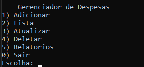
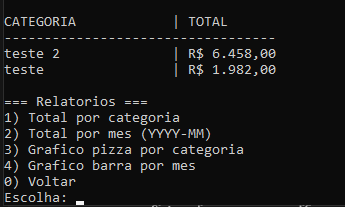

# 📊 Gerenciador de Despesas


Um sistema simples em **Python** para controle e acompanhamento de despesas pessoais.  
O objetivo é permitir o cadastro de gastos, categorias, geração de relatórios e visualização das finanças de forma prática e organizada.  

---

## 📑 Índice

- [Funcionalidades](#-funcionalidades-implementadas)  
- [Status do Desenvolvimento](#-status-do-desenvolvimento)  
- [Tecnologias Utilizadas](#-tecnologias-utilizadas)  
- [Próximos Passos](#-próximos-passos)  
- [Como Executar](#-como-executar-o-projeto)  
- [Demonstração](#-demonstração)  
- [Contribuição](#-contribuição)  
- [Licença](#-licença)  

---

## 🚀 Funcionalidades implementadas

- ✅ **Cadastro de despesas** com valor, categoria e data  
- ✅ **Listagem de despesas** com filtros  
- ✅ **Edição e exclusão** de despesas cadastradas  
- ✅ **Controle por categoria** (organização básica)  
- ✅ Estrutura inicial para **relatórios**  

---

## ⚠️ Status do Desenvolvimento

O desenvolvimento encontra-se **pausado na parte de relatórios** (`acao_relatorios`).  
Durante os testes, ocorreu o seguinte erro:

```bash
TypeError: argument of type 'builtin_function_or_method' is not iterable
```

O que isso significa?

Os relatórios já estão estruturados, mas ainda não exibem os valores formatados em reais (R$)

A parte de gráficos com Matplotlib chegou a ser iniciada, mas ainda não está totalmente configurada

## 🔧 Tecnologias utilizadas

🐍 Python 3.12+

🗄️ SQLite (banco de dados local)

📊 Matplotlib (planejado para relatórios visuais)

## Próximos Passos

Finalizar a função de relatórios com valores em reais

Implementar gráficos para visualização das despesas

Melhorar a interface de uso no terminal

(Opcional) Criar uma interface gráfica futuramente

# Clone o repositório
git clone https://github.com/Thiago-c-souza/Gerenciador_despesas.git

# Acesse a pasta
cd gerenciador_despesas

# Como Executar
python main.py

pip install -r requirements.txt

# Demonstração



## 🤝 Contribuição

Se quiser contribuir com melhorias:

Faça um fork do projeto

Crie uma branch com sua feature (git checkout -b minha-feature)

Commit suas alterações (git commit -m 'Adiciona nova funcionalidade')

Faça um push (git push origin minha-feature)

Abra um Pull Request

## 📜 Licença

Este projeto está sob a licença MIT.
Sinta-se livre para usar, modificar e compartilhar.

## 👨‍💻 Autor

Desenvolvido por Thiago Caixeta de Souza 🚀
